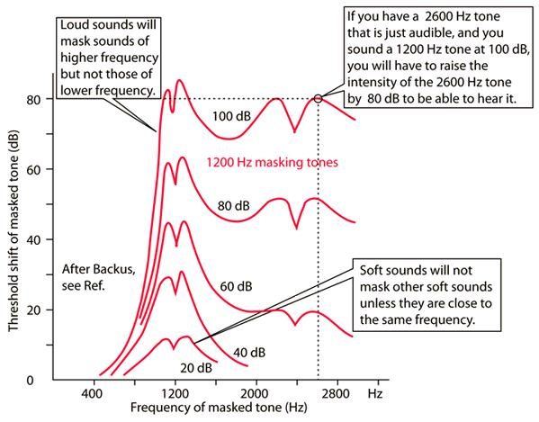
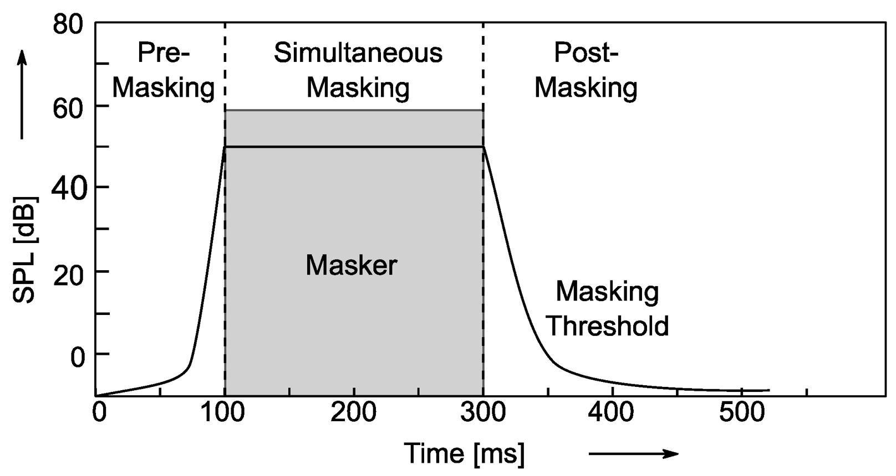
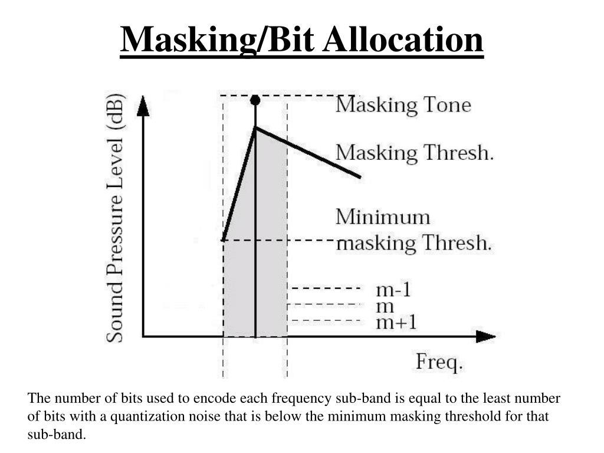

# Psychoacoustic Masking, etc.

1. Psychoacoustic masking does the heavy lifting

Around 192 kbps, MP3 has enough bits to model what your ears can actually 
hear - and to hide what it throws away.

Here's the engineering synopsis behind that:

MP3 (formally MPEG-1 Audio Layer III) uses a psychoacoustic model to decide what can be discarded.

Two key effects:

* Frequency masking: loud tones hide nearby frequencies
* Temporal masking: sounds hide others just before/after them

At ~192 kbps, there are enough bits to keep everything above the masking threshold, so removed data is (ideally) inaudible.

2. Quantization noise is pushed under the masking threshold

Compression introduces noise (quantization error), but MP3:

* Shapes that noise
* Allocates more bits to perceptually sensitive bands

At lower bitrates, noise leaks above masking - audible artifacts

Around 192 kbps, noise is usually buried - "transparent" for most listeners

3. Bit reservoir smooths out complexity spikes

 MP3 uses a bit reservoir:

* Simple passages use fewer bits
* Saved bits are spent on complex passages (e.g., cymbals, transients)

At ~192 kbps, there's enough headroom to avoid "starving" difficult sections

4. Bandwidth is essentially preserved

Lower bitrates often:

* Cut high frequencies aggressively (e.g., 128 kbps ~16 kHz lowpass)

At ~192 kbps:

* Frequency response often extends near ~19 kHz

That removes one of the most obvious cues of compression

5. Transform resolution is "good enough"

MP3 uses hybrid filterbanks + MDCT:

* Time/frequency resolution tradeoffs can cause artifacts (e.g., pre-echo)

At higher bitrates:

* Finer quantization reduces these artifacts significantly

6. Artifacts are still there -- but harder to trigger

Classic MP3 artifacts:

* Pre-echo (smearing before transients)
* "Swishy" cymbals
* Stereo image collapse (joint stereo misuse)

At ~192 kbps:

* These require specific material + trained listening to detect

Critical listeners can still ABX differences -- especially with:

* Solo piano
* Castanets
* Harsh transients
* Re-encoded material

Bottom line

* At ~192 kbps, MP3 reaches a tipping point where:

* The psychoacoustic model is no longer bit-starved
* Quantization noise stays masked
* Bandwidth loss is minimal
* Artifacts become edge cases

Result: for most real-world listening, it becomes perceptually transparent or very close to it

[Back to README](README.md)

